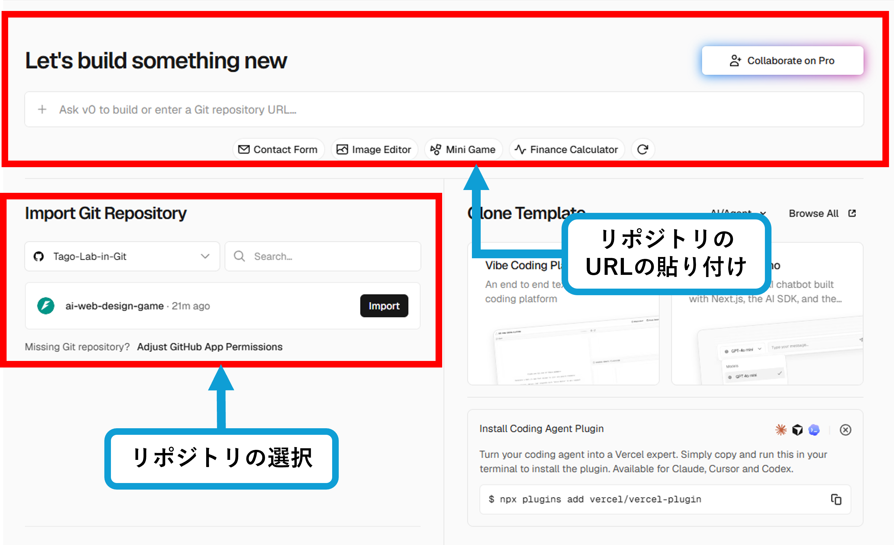
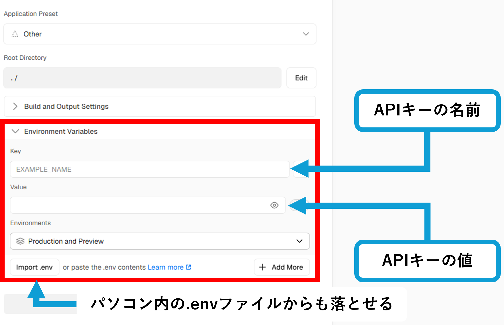
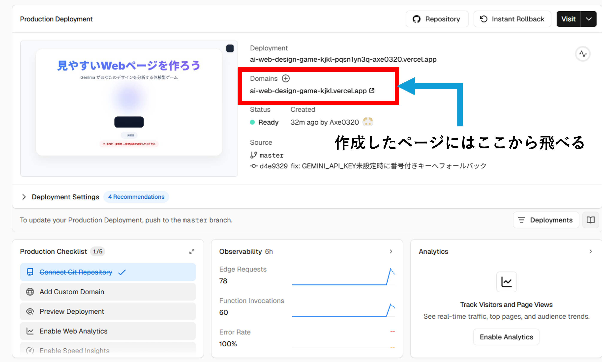
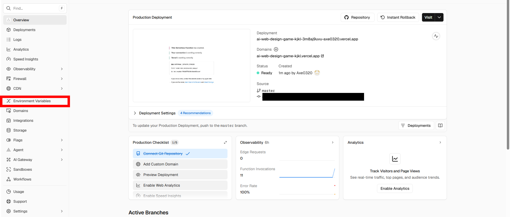
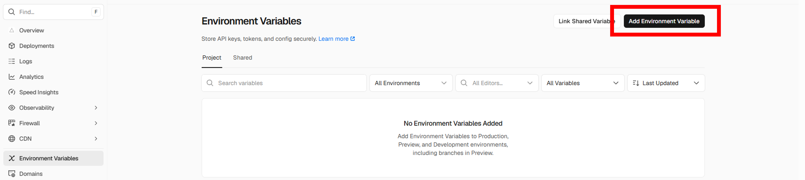
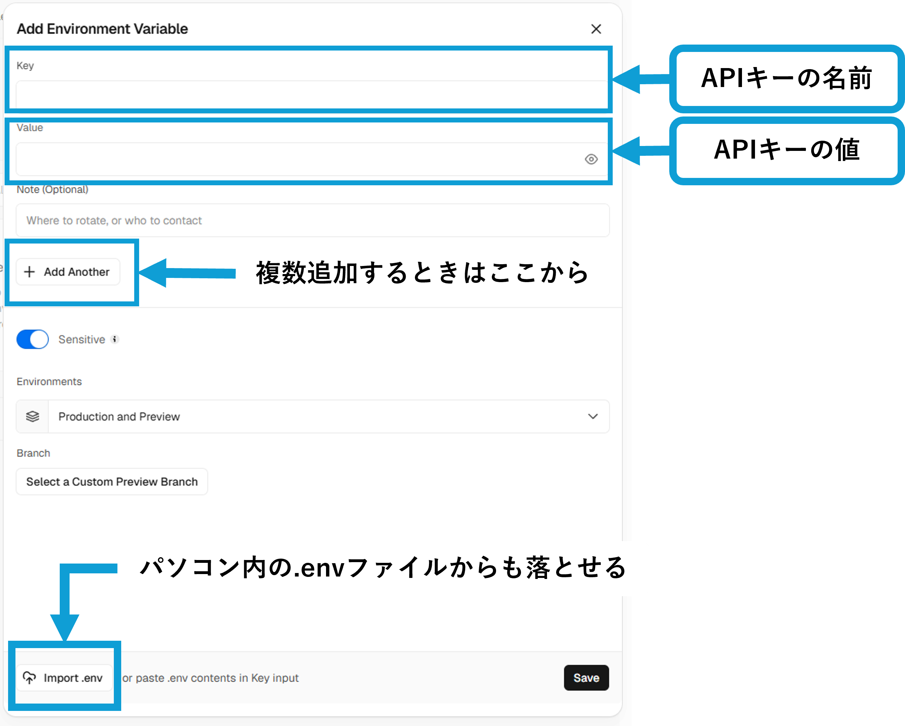
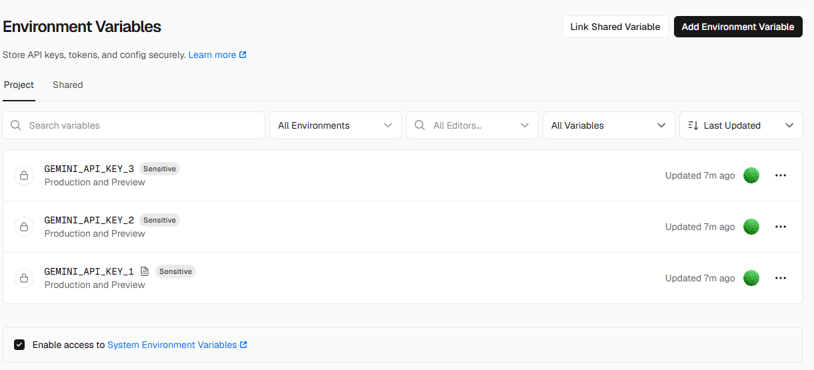

# Vercel デプロイ手順

---

## 1. 初回デプロイ

### 1.1 Vercel アカウントの作成

[vercel.com](https://vercel.com) にアクセスし、**GitHub アカウントで Sign in** します。

---

### 1.2 リポジトリのインポート

「Add New Project」からこのリポジトリを選択し、Import します。

---

### 1.3 環境変数（APIキー）の設定

「Environment Variables」に使用するAPIキーを入力します。

Key 名は `GEMINI_API_KEY` または `GEMINI_API_KEY_1` `_2` ... のように連番で設定します。

| Key | Value |
|---|---|
| `GEMINI_API_KEY_1` | APIキー1の値 |
| `GEMINI_API_KEY_2` | APIキー2の値 |
| `GEMINI_API_KEY_3` | APIキー3の値 |
| `...` | 最大20本まで追加可能 |

> **注意**：APIキーは **個人のGoogleアカウント** で発行してください。
> 大学アカウント（@chibatech.ac.jp 等）では組織ポリシーによりアクセスが制限される場合があります。
> また、Gemmaモデルの利用には Google AI Studio での**利用規約への同意**が別途必要です。

---

### 1.4 デプロイ完了・URLの確認

設定後に「Deploy」を押すとデプロイが始まり、完了するとURLが発行されます。

---

## 2. APIキーの追加・変更

デプロイ後にAPIキーを追加・変更する場合は、Vercel ダッシュボードから操作します。

---

### 2.1 Settings → Environments を開く

プロジェクトページから **Settings → Environments** を選択します。

---

### 2.2 「Add Environment Variable」を押す

---

### 2.3 環境変数を入力

Key と Value を入力して保存します。

---

### 2.4 追加完了

追加されたキーの**変更・削除**もこの画面から行えます。

変更後は **Deployments タブ → 最新のデプロイ → Redeploy** で再デプロイしてください。
