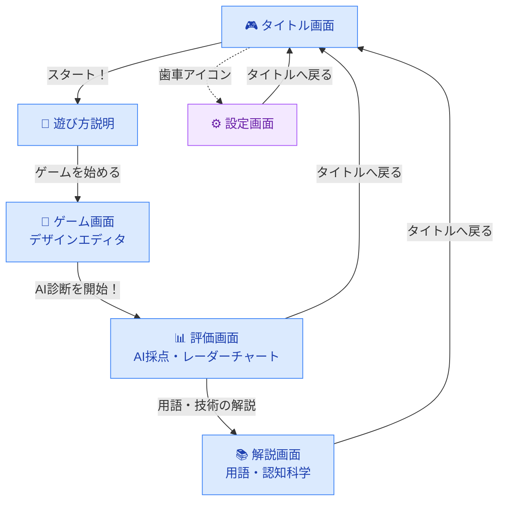
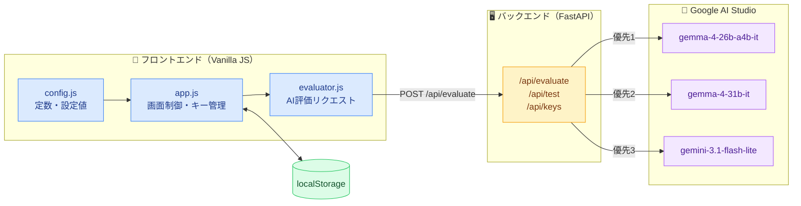
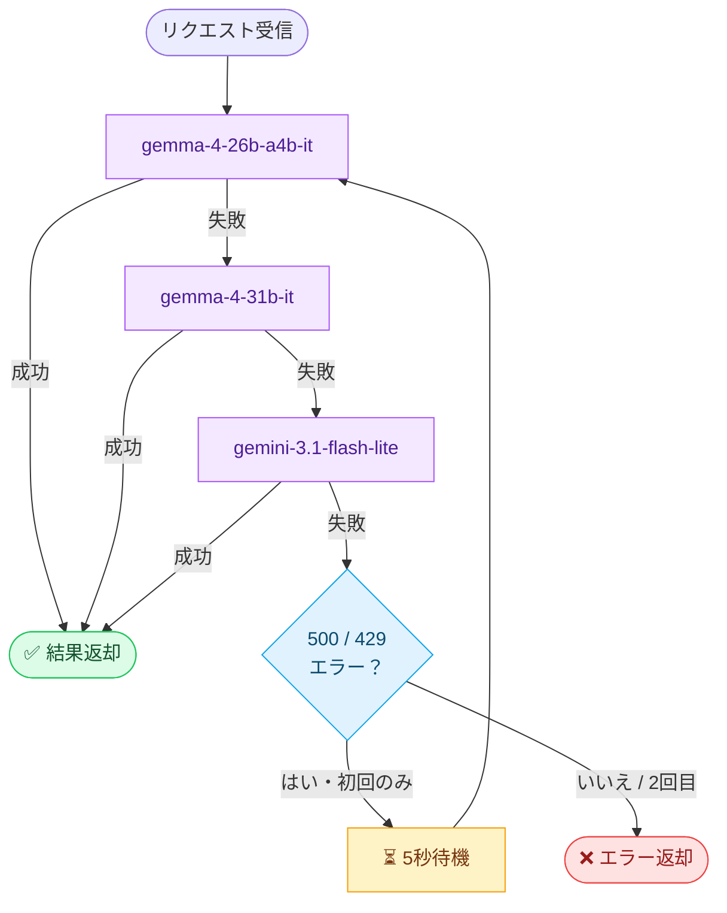

# 見やすいWebページを作ろう 設計ドキュメント

千葉工業大学認知情報科学科のオープンキャンパス向けに開発した、体験型Webゲームです。

プレイヤーが色・フォント・レイアウトを自由に組み合わせてWebページをデザインし、
Google の生成AIモデル（Gemma / Gemini）が3つの観点から評価・採点します。

[](https://www.python.org)
[](https://fastapi.tiangolo.com)
[](https://developer.mozilla.org/docs/Web/JavaScript)
[](https://developer.mozilla.org/docs/Web/HTML)
[](https://developer.mozilla.org/docs/Web/CSS)
[](https://ai.google.dev)
[](https://vercel.com)

- **公開URL（Vercel）**: https://ai-web-design-game-portfolio.vercel.app/

---

## 1. システム概要

本システムは、**Webページのデザインを体験的に学ぶ教育用Webゲーム**です。

高校生・一般の方が「デザインの面白さ」と「AI の可能性」を同時に体験することを目的としています。

設計上の方針は以下の通りです。

* **シングルページ構成**：ページ遷移はすべてDOM表示切替で行い、リロードを発生させない
* **バックエンド最小化**：AIへのリクエスト中継と静的ファイル配信のみをサーバーで担う
* **フォールバック設計**：複数モデルを優先順位付きで試行し、エラー時は自動切替・リトライ

---

## 2. 設定画面

> **🔑 設定画面パスワードはリポジトリ管理者が個別に管理しています。**

タイトル画面右上の歯車アイコンからアクセスできます（パスワード保護あり）。

| 機能 | 内容 |
|---|---|
| モデル優先順位 | ↑/↓ボタンで試行順序を変更（localStorage に保存・API呼び出し時に反映） |
| APIキー管理 | 環境変数キーの選択 / 直接入力による切替 |
| テストモード | AIを呼び出さずモックデータで全画面の動作を確認 |
| API疎通テスト | 選択中のキー・モデルへの接続確認（エラーコード・原因も表示） |
| localStorage クリア | 保存された設定をすべてリセット |

---

## 3. ゲームフロー



---

## 4. ディレクトリ構成

```
web-geme-opencampus/
├── main.py                  ← FastAPI サーバー
├── grade.py                 ← グレード判定
├── prompt_body.txt          ← AI評価プロンプト（共通部分）
├── prompt_visibility.txt    ← 視認性評価プロンプト
├── prompt_layout.txt        ← レイアウト評価プロンプト
├── prompt_cognitive.txt     ← 認知負荷評価プロンプト
├── explanations.json        ← 解説コンテンツデータ
├── requirements.txt         ← Python依存パッケージ
├── vercel.json              ← Vercelデプロイ設定
├── .env                     ← APIキー設定（Git管理外）
├── figures/                 ← ドキュメント用画像
├── DOCUMENT.md              ← 詳細仕様・設計ドキュメント
├── DEPLOY.md                ← Vercelデプロイ手順
└── static/
    ├── index.html           ← メインHTML（全ページのコンテナ）
    ├── css/
    │   ├── base.css         ← 共通スタイル・CSS変数
    │   ├── title.css        ← タイトル画面
    │   ├── howto.css        ← 遊び方画面
    │   ├── game.css         ← ゲーム画面（エディタ）
    │   ├── evaluation.css   ← 評価画面
    │   ├── explanation.css  ← 解説画面
    │   └── settings.css     ← 設定画面
    ├── js/
    │   ├── app.js           ← メインアプリロジック
    │   ├── config.js        ← 定数・設定値
    │   └── evaluator.js     ← AI評価リクエスト処理
    ├── pages/
    │   ├── title.html       ← タイトル画面
    │   ├── how-to.html      ← 遊び方画面
    │   ├── game.html        ← ゲーム画面
    │   ├── evaluation.html  ← 評価画面
    │   ├── explanation.html ← 解説画面
    │   └── settings.html    ← 設定画面
    └── img/
        └── hero.png
```

※ 詳細な仕様・設計については [`DOCUMENT.md`](./DOCUMENT.md) を参照してください。

---

## 5. システム構成



### 5.1 バックエンド（Python / FastAPI）

**責務**

* 静的ファイルの配信
* AI評価リクエストの中継（`/api/evaluate`）
* API接続テスト（`/api/test`）
* 環境変数キー一覧の提供（`/api/keys`）

**設計ポイント**

* `asyncio.to_thread` によるブロッキングSDK呼び出しの非同期化（3カテゴリの並列リクエストを同時処理）
* モデルを優先順位付きリストで管理し、失敗時に自動フォールバック
* `500 INTERNAL` / `429 RATE_LIMITED` を検知し、5秒待機後に1回リトライ

**ファイル**

* `main.py` ← APIエンドポイント・モデル呼び出しロジック
* `grade.py` ← スコア値からグレード（S / A / B / C / D）を判定

---

### 5.2 AIモデル設定

```python
MODELS = [
    "gemma-4-26b-a4b-it",    # 優先1（安定・実績あり）
    "gemma-4-31b-it",         # 優先2（高精度・間欠的に利用可）
    "gemini-3.1-flash-lite",  # 優先3（フォールバック用）
]
```

上から順に試行し、失敗した場合の動作は以下の通りです。



**レート制限（無料枠・参考値）**

| モデル | RPM | RPD | TPM |
|---|---|---|---|
| Gemma 4 系 | 15 | 1,500 | 1,000,000 |
| Gemini 3.1 Flash Lite | 15 | 500 | 250,000 |

---

### 5.3 AI評価カテゴリ

3カテゴリを並列実行し、それぞれスコア・グレード・改善アドバイスを返します。

| カテゴリID | 評価内容 | プロンプトファイル |
|---|---|---|
| `visibility` | 視認性（色のコントラスト・文字サイズ等） | `prompt_visibility.txt` |
| `layout` | レイアウト（余白・整列・構造等） | `prompt_layout.txt` |
| `cognitive` | 認知負荷（情報量・複雑さ等） | `prompt_cognitive.txt` |

共通部分は `prompt_body.txt` で管理し、各カテゴリ固有の指示を差し込む形で構成されています。

---

### 5.4 フロントエンド（Vanilla JS / ES Modules）

バンドラーなしのES Modulesで構成されています。

**ファイルと責務**

| ファイル | 責務 |
|---|---|
| `static/js/app.js` | 画面制御・ナビゲーション・APIキー管理・バッジ更新・モデル順序管理 |
| `static/js/evaluator.js` | AI評価リクエスト送信・レスポンス処理・テストモード |
| `static/js/config.js` | 定数・カラーマップ・スライダー定義・パスワードハッシュ |

**状態管理**

アプリ内の永続状態は localStorage で管理します。

| キー | 内容 |
|---|---|
| `keyMode` | `"env"` または `"custom"` |
| `keyIndex` | 選択中の環境変数キー番号 |
| `customKey` | 直接入力したAPIキー |
| `modelOrder` | モデル優先順位（JSON配列）|
| `testMode` | `"on"` でAI呼び出しをスキップ |
| `lastModelName` | 前回成功したモデル名（タイトル画面バッジに表示）|

---

## 6. Vercelデプロイ

詳細な手順（スクリーンショット付き）は **[DEPLOY.md](./DEPLOY.md)** を参照してください。

### 概要

`vercel.json` が設定済みのため、GitHubリポジトリをインポートするだけでデプロイできます。

デプロイ時に以下の環境変数を設定してください。
Key 名は `GEMINI_API_KEY` または `GEMINI_API_KEY_1` `_2` ... のように連番で設定します。

| Key | Value |
|---|---|
| `GEMINI_API_KEY_1` | APIキー1の値 |
| `GEMINI_API_KEY_2` | APIキー2の値 |
| `GEMINI_API_KEY_3` | APIキー3の値 |
| `...` | 最大20本まで追加可能 |

> **補足**：`GEMINI_API_KEY`（番号なし）が未設定でも、`GEMINI_API_KEY_1` 以降が設定されていれば自動的にフォールバックします。

---

## 7. 仕様の変更方法

### モデルの追加・変更

`main.py` の `MODELS` と `static/js/app.js` の `DEFAULT_MODELS` を**両方同時に**更新します。

```python
# main.py
MODELS = [
    "gemma-4-26b-a4b-it",
    "gemma-4-31b-it",
    "gemini-3.1-flash-lite",
    "your-new-model",  # 追加・変更
]
```

```javascript
// static/js/app.js
const DEFAULT_MODELS = ['gemma-4-26b-a4b-it', 'gemma-4-31b-it', 'gemini-3.1-flash-lite', 'your-new-model'];
```

### APIキーの追加・変更

**[DEPLOY.md — 2. APIキーの追加・変更](./DEPLOY.md#2-apiキーの追加変更)** を参照してください。

### 評価カテゴリの追加・変更

1. `prompt_{カテゴリ名}.txt` を作成または編集
2. `static/js/app.js` の `categories` 配列を更新
3. `static/pages/evaluation.html` に対応するカードを追加または修正

### グレード基準の変更

`grade.py` のスコア閾値を修正します。

---

## 8. 非対応事項（仕様）

* ユーザーアカウント・セッション管理
* 評価履歴の永続化（リロードでリセット）
* モバイル端末への最適化

---

## 9. 環境構築（ローカル実行）

### 9.1 必要なもの

* Python 3.10 以上
* Google AI Studio の APIキー（[aistudio.google.com](https://aistudio.google.com)）

### 9.2 手順

**1. 依存パッケージのインストール**

```bash
pip install -r requirements.txt
```

**2. APIキーの設定**

`.env` ファイルをプロジェクトルートに作成します。

```env
GEMINI_API_KEY_1=your_key_1
GEMINI_API_KEY_2=your_key_2
GEMINI_API_KEY_3=your_key_3
```

**3. サーバー起動**

```bash
python main.py
```

**4. ブラウザでアクセス**

```
http://localhost:8001
```

---

## 10. 補足事項

* `.env` は `.gitignore` に含まれています。**絶対にコミットしないでください**
* Gemma モデルの利用には [Google AI Studio](https://aistudio.google.com) での利用規約への同意が必要です
